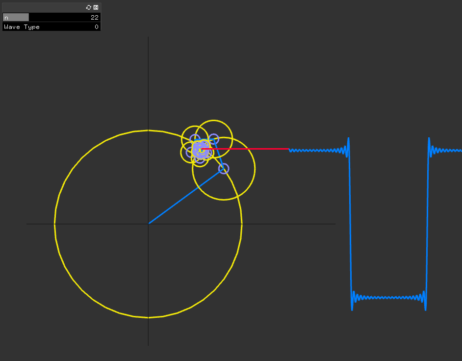
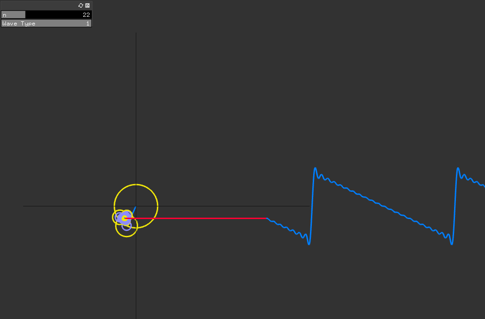

# Fourier Series Visualization
A quick project playing around with the openFrameWorks C++ toolkit. 
Can use GUI to increase the number of iterations or the type of wave.  

## Images

## To Do 
- Add more wave types.
- Add Gui controls for speed and radius. 
- Add color control / more tracelines. 

## Resources
[The Coding Train](https://thecodingtrain.com/CodingChallenges/125-fourier-series.html)

[Purrier Series (Meow) and Making Images Speak](https://bilimneguzellan.net/en/purrier-series-meow-and-making-images-speak/)

[An Interactive Guide To The Fourier Transform](https://betterexplained.com/articles/an-interactive-guide-to-the-fourier-transform/)
